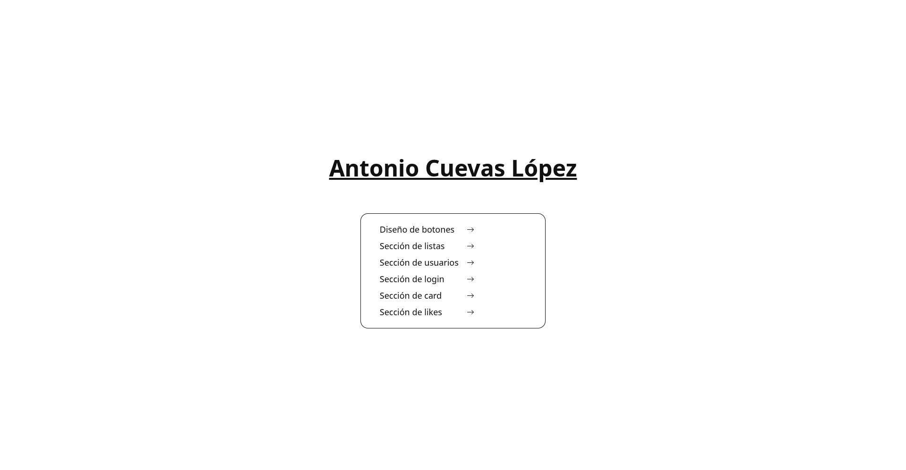
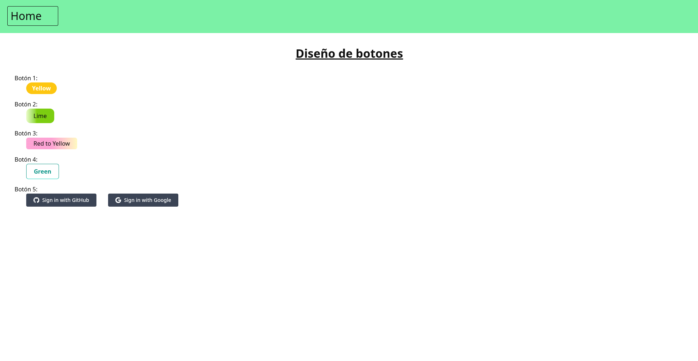
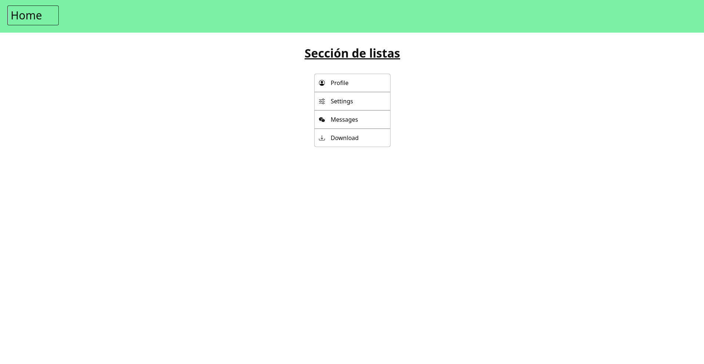
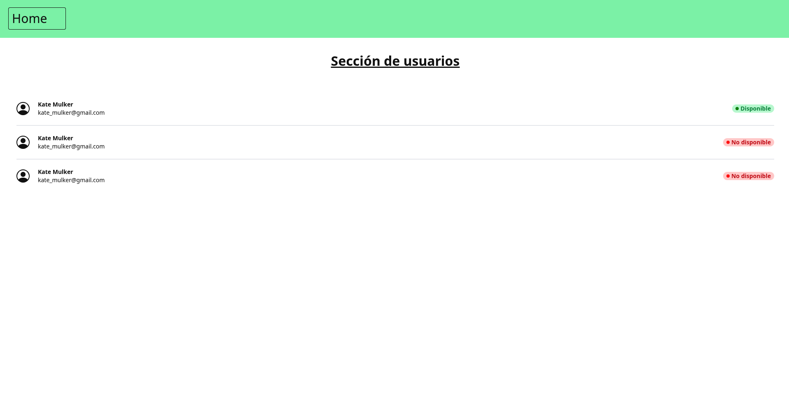
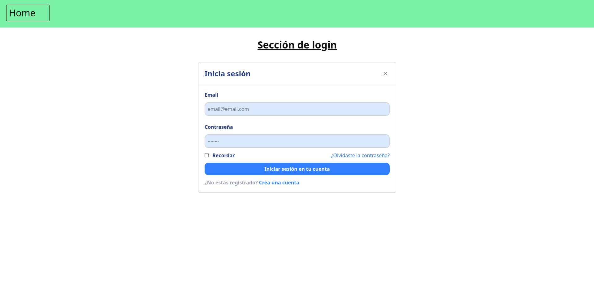
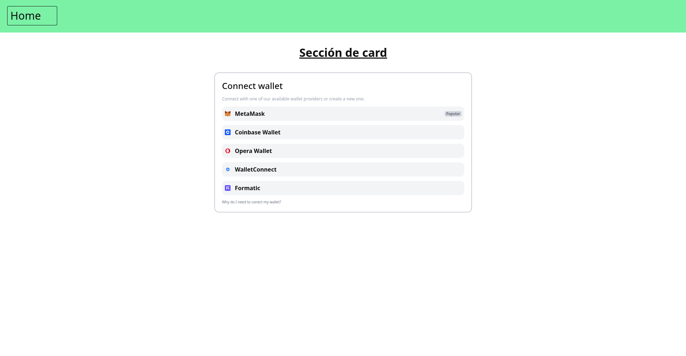
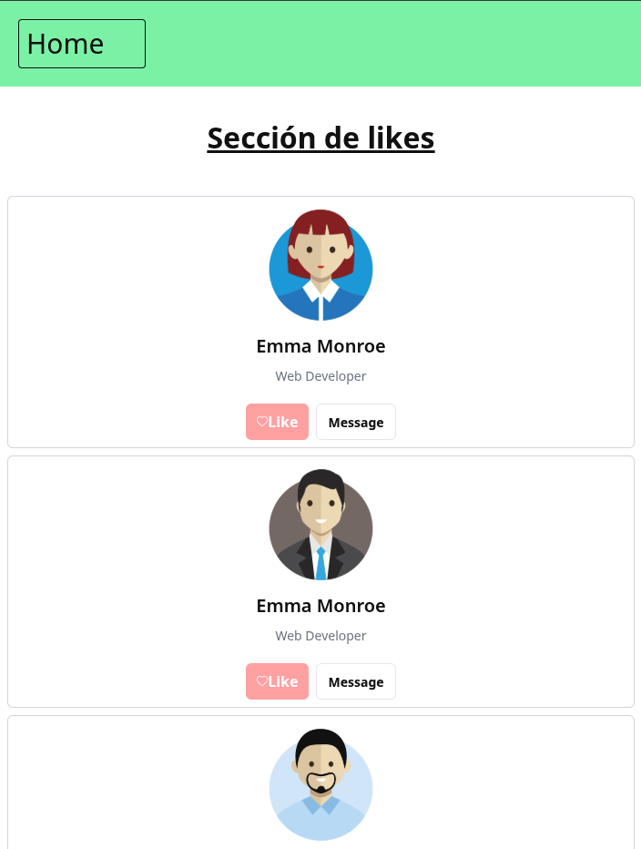
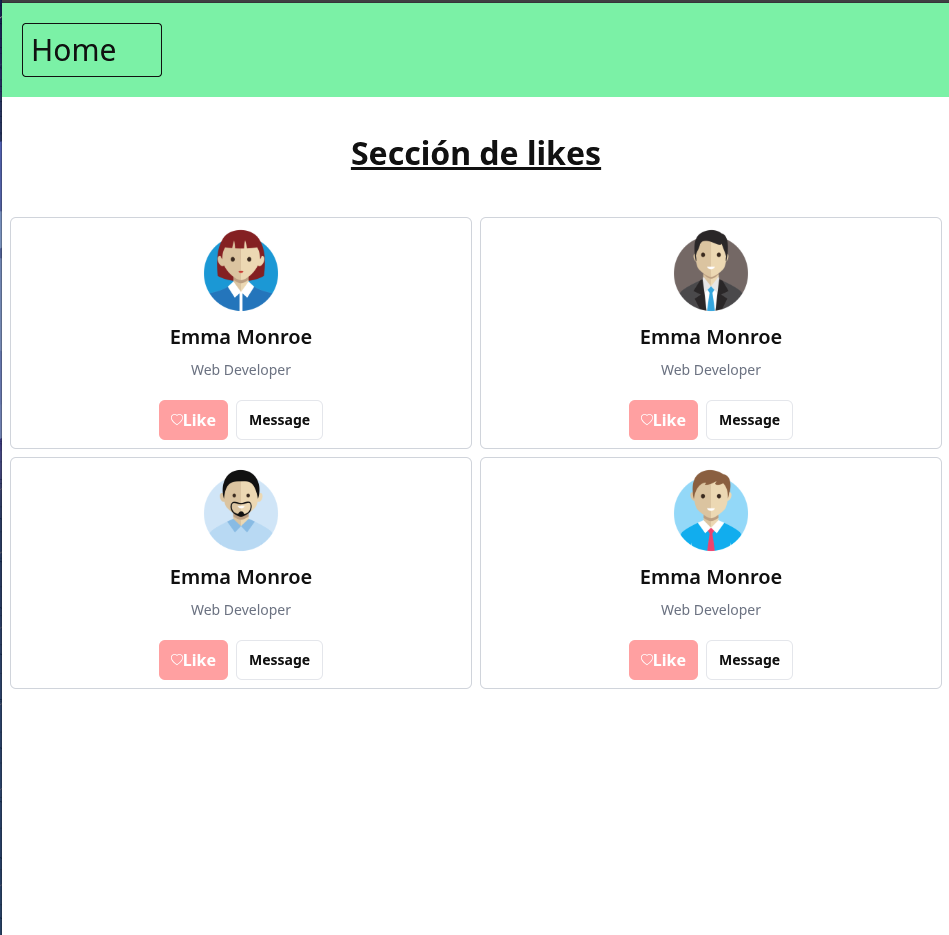
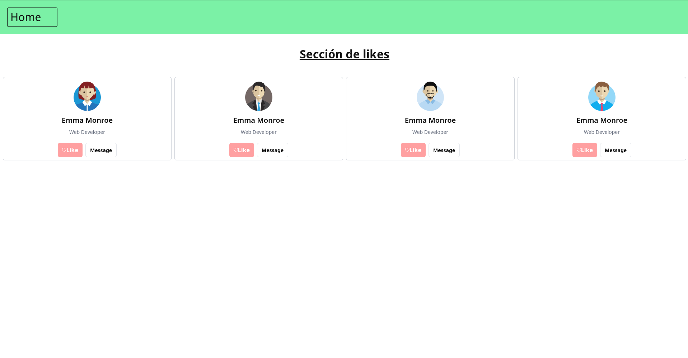

# Diseño de componentes en TailwindCSS
En este proyecto se pone en práctica todo lo aprendido en clase generando pequeños componentes con html y tailwind css.

## Componente principal
Componente con mi nombre en el centro y un menú para poder navegar por todas las ventanas.

## Componente 1: Diseño de botones

## Componente 2: Sección de listas

## Componente 3: Sección de usuarios

## Componente 4: Sección de login

## Componente 5: Sección de card

## Componente 6: Sección de likes
### Tamaño pequeño
Tamaño pequeño para dispositivos móviles. Una sola columna con todos los componentes.

### Tamaño mediano
Para dispositivos medianos. Dos columnas que contienen todos los elementos.

### Tamaño grande
Para pantallas más grandes. Cuatro columnas con todos los componentes.

